# TP Observabilité

---

## Module 1 — Prometheus

### Exercice 1 — Installation de Prometheus

Prometheus est opérationnel et se scrape lui-même — la cible apparaît en état **UP** avec un scrape toutes les ~4 secondes.

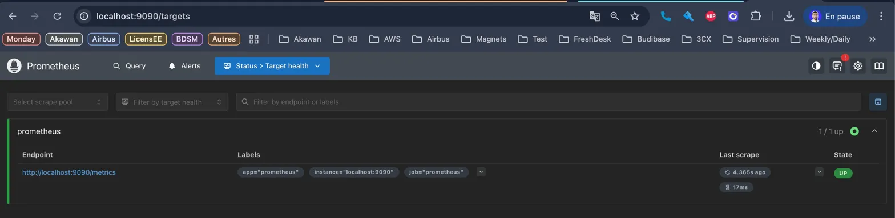

### Exercice 2 — Premier fichier prometheus.yml

La configuration personnalisée est bien chargée : l'intervalle de scrape à 10s et le label `environment: lab` sont visibles dans **Status > Configuration**.

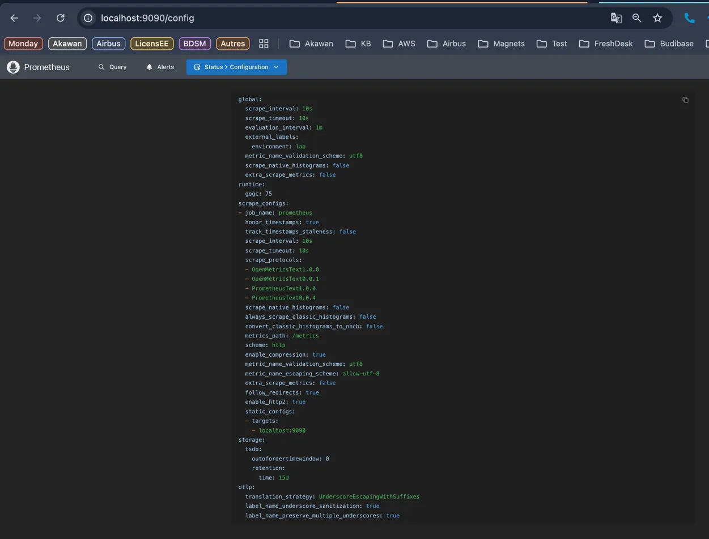

### Exercice 3 — Ajout de node_exporter

Les deux cibles `prometheus` et `node` sont **UP**. Prometheus scrape désormais les métriques système exposées par `node_exporter`.

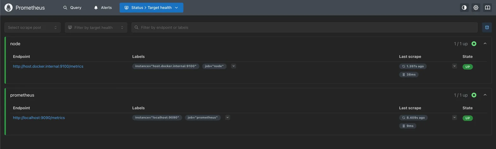

La métrique `node_cpu_seconds_total` retourne 64 séries correspondant aux différents CPU et modes d'utilisation (idle, user, system...).

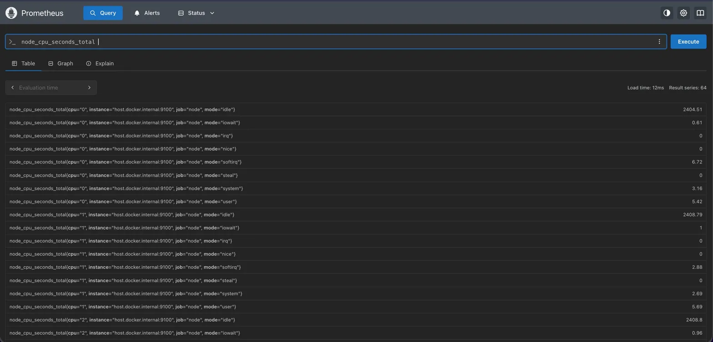

### Exercice 4 — Découverte de service par fichier (file_sd_configs)

Les cibles sont découvertes dynamiquement depuis `sd/targets.json` sans avoir besoin de recharger Prometheus.

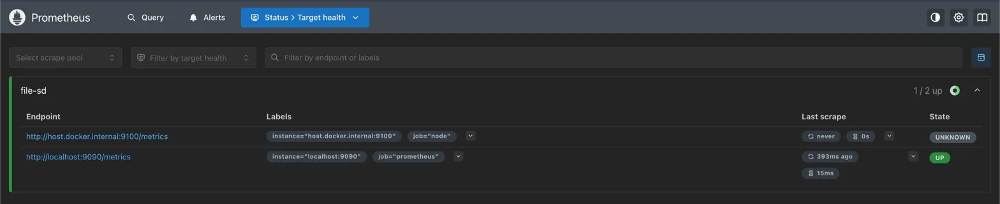

L'ajout d'une cible fictive dans le fichier JSON est pris en compte automatiquement en moins de 5 secondes — elle apparaît en **DOWN** car elle n'existe pas réellement.

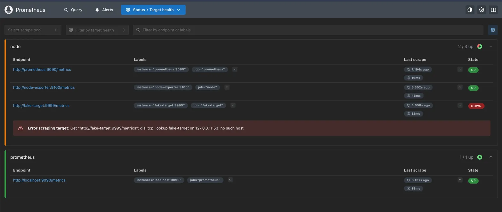

### Exercice 5 — Règles d'enregistrement (recording rules)

`demo-api` est bien scrapée et ses métriques sont disponibles.

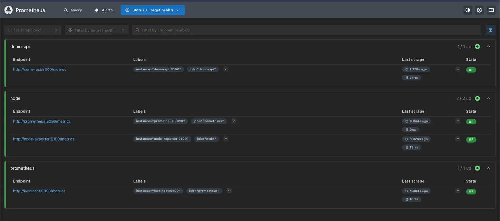

La règle `job:http_requests:rate5m` est chargée et évaluée toutes les 30 secondes avec le statut **OK**.

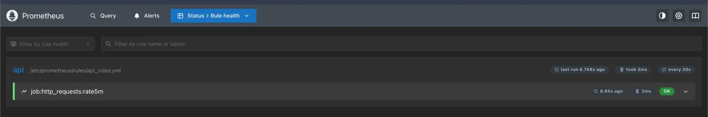

La métrique pré-calculée retourne 3 séries correspondant aux combinaisons endpoint/status du trafic généré.

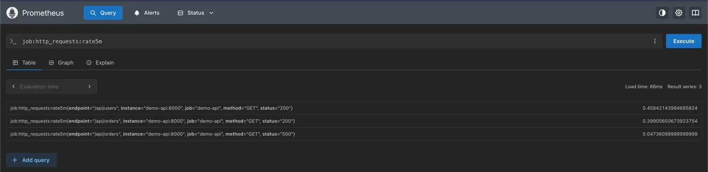

### Exercice 6 — Règles d'alerte et Alertmanager

L'alerte `HighErrorRate` passe en état **FIRING** après 2 minutes — le taux d'erreurs 500 sur `/api/orders` dépasse bien le seuil de 5%.

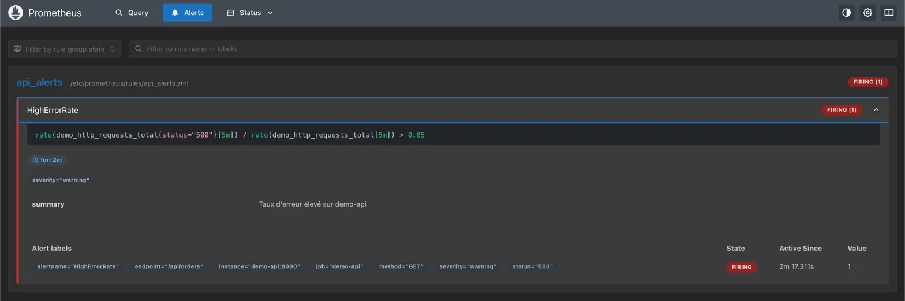

Alertmanager reçoit bien l'alerte et l'affiche avec les labels correspondants (`endpoint="/api/orders"`, `status="500"`).

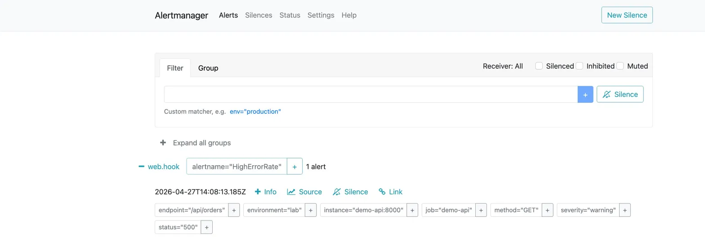

### Exercice 7 — PromQL : types de données

**`demo_http_requests_total`** — vecteur instantané : retourne une valeur unique par série au moment de l'évaluation.

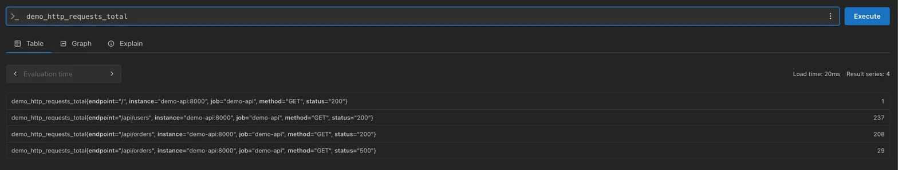

**`demo_http_requests_total[1m]`** — vecteur de plage : retourne l'historique des valeurs sur 1 minute pour chaque série.

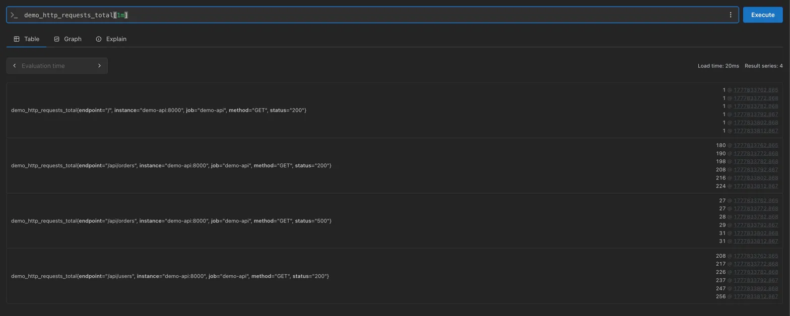

**`rate(demo_http_requests_total[1m])`** — convertit le vecteur de plage en vecteur instantané : retourne le taux de requêtes par seconde pour chaque combinaison endpoint/status/method.

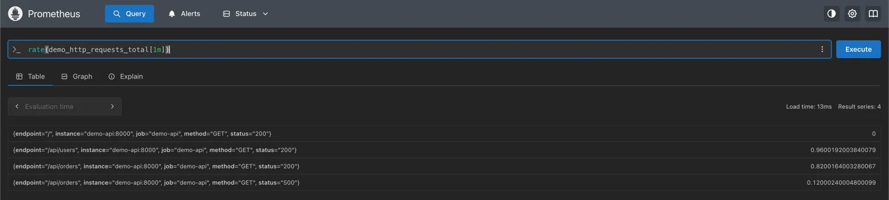

**`scalar(sum(demo_http_requests_total))`** — scalaire : agrège toutes les séries en une seule valeur numérique (603 requêtes au total).

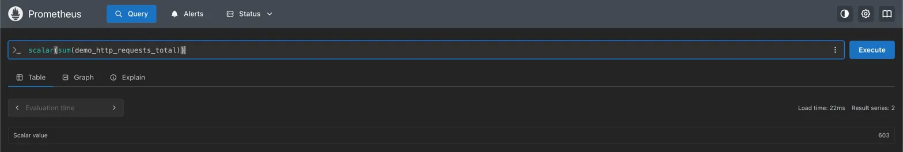

### Exercice 8 — PromQL : agrégations

**`sum by (endpoint) (rate(demo_http_requests_total[5m]))`** — calcule le taux de requêtes par seconde agrégé par endpoint sur 5 minutes. `/api/users` et `/api/orders` ont un trafic pratiquement similaire (~0.15 req/s).

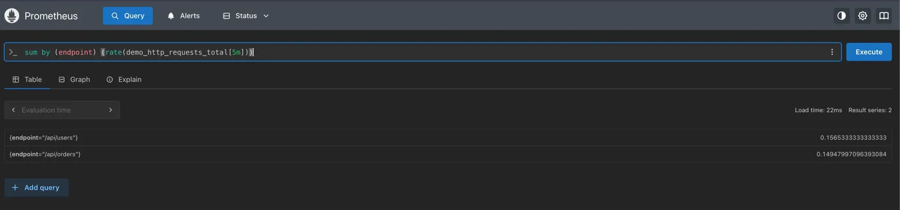

**Ratio d'erreurs par endpoint** — divise le taux d'erreurs 500 par le taux total. Seul `/api/orders` apparaît avec ~11% d'erreurs, `/api/users` ne générant aucune erreur.

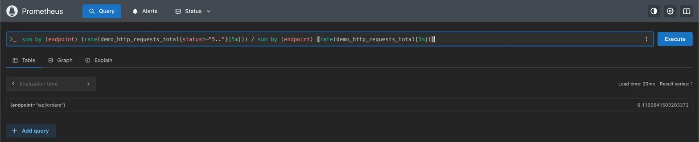

**`topk(3, ...)`** — classe les endpoints par taux de requêtes décroissant. Seuls 2 endpoints existent dans notre setup.

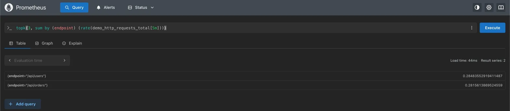